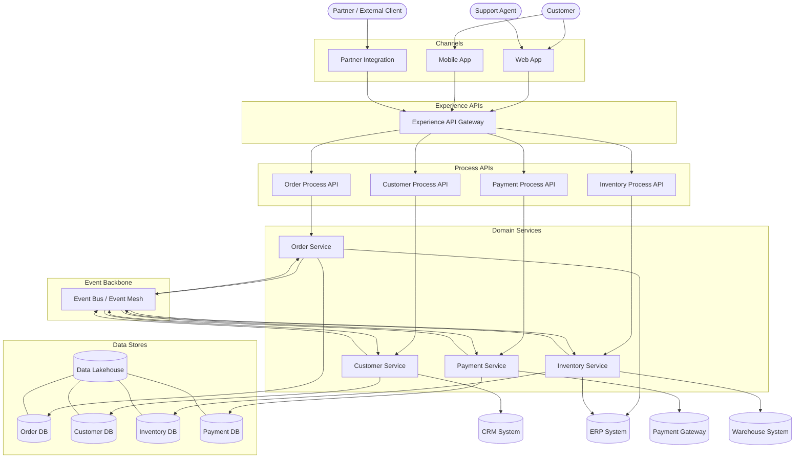
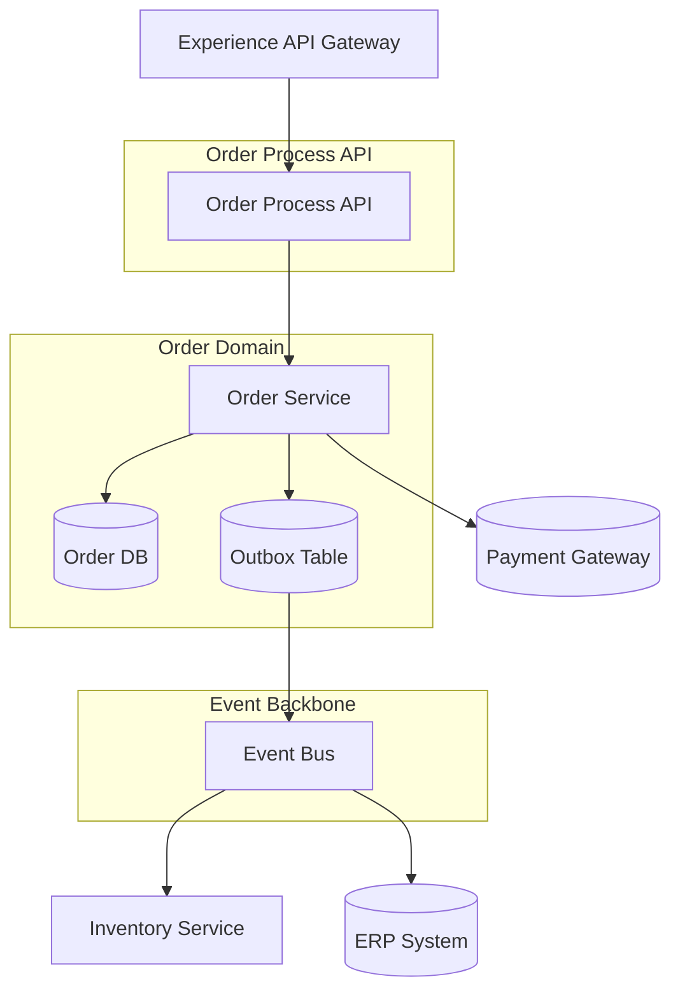
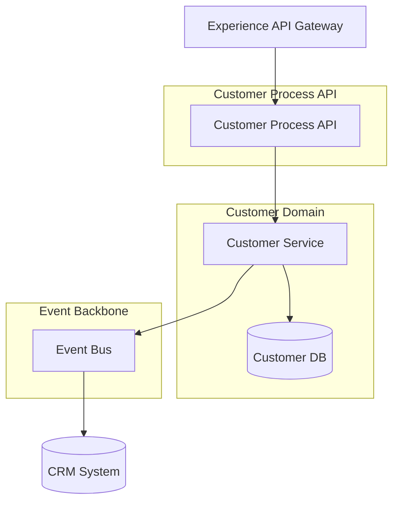
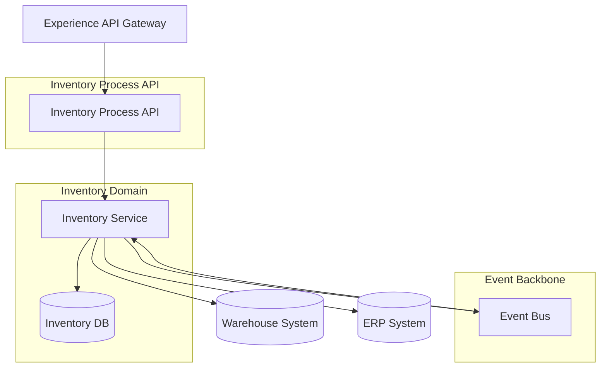
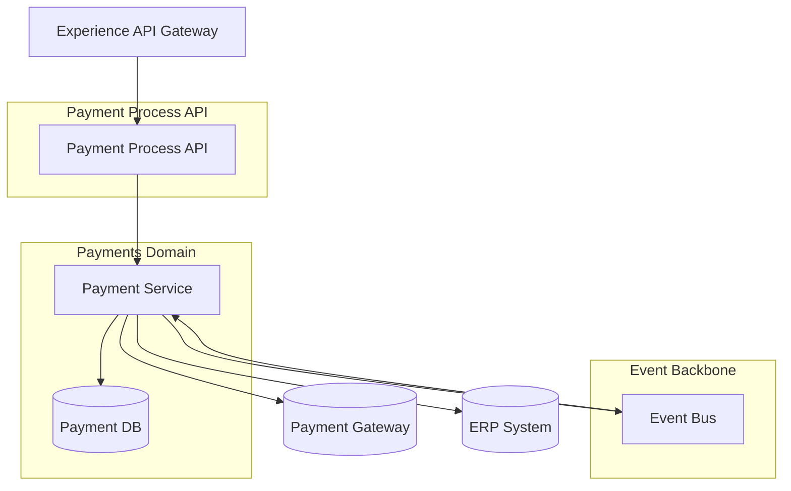

# 🧱 C4 Model — Container Diagrams  
*Level 2 view of the Enterprise Platform*

These diagrams show the main containers (APIs, services, data stores, event backbone, and external systems) and how they interact.

---

## 1. Enterprise Platform — Container Diagram

## 2. Order Domain — Container Diagram

## 3. Customer Domain — Container Diagram

## 4. Inventory Domain — Container Diagram

## 5. Payments Domain — Container Diagram

## 6. Related Artifacts
/architecture/diagrams/system-context.md

/architecture/diagrams/integration-sequence-diagrams.md

/architecture/integration-architecture.md

/events/event-naming-and-domain-modeling-guide.md

/governance/api-standards-and-governance-guide.md