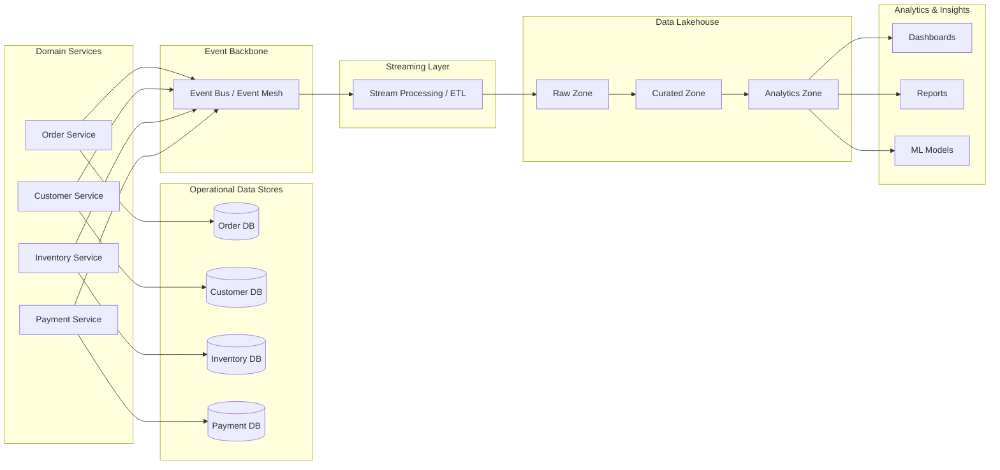

# 🗄️ Data Architecture Overview  
*A unified view of operational, analytical, and event-driven data flows across the enterprise.*

---

# 🧭 1. Purpose

This document defines the enterprise data architecture that supports both operational workloads and analytical insights. It ensures:

- Consistent data models across domains  
- Reliable multi-region replication  
- Real-time and batch data processing  
- Strong governance and lineage  
- Scalable analytical capabilities  

This architecture aligns with the integration, domain, and event-driven strategies defined elsewhere in the platform.

---

# 🧱 2. Data Architecture Principles

### **1. Domain-Owned Operational Data**
Each domain owns its operational data store (ODS) and is responsible for data quality.

### **2. Event-Driven Data Propagation**
Domain events are the primary mechanism for cross-domain data sharing.

### **3. Analytical Data Separation**
Operational and analytical workloads are separated to avoid coupling and performance issues.

### **4. Lakehouse as the Analytical Source of Truth**
All analytical data flows into the enterprise lakehouse.

### **5. Multi-Region Resilience**
Data is replicated across regions for availability and disaster recovery.

### **6. Governance by Design**
Metadata, lineage, and quality rules are enforced automatically.

---

# 🧩 3. High-Level Data Architecture

#  🧱 4. Operational Data Architecture
Domain-Owned Datastores
Each domain has its own datastore:

Order DB

Customer DB

Inventory DB

Payment DB

Characteristics
Optimized for OLTP

Enforced invariants

Backed by Outbox Pattern for event publishing

Region-local for performance

#  ⚡ 5. Event-Driven Data Flows
Domain Events → Streaming Layer → Lakehouse
Events flow through:

Event Backbone

Stream Processing Layer (ETL, enrichment, CDC)

Lakehouse Raw Zone

Curated Zone

Analytics Zone

Benefits
Real-time insights

Decoupled data propagation

Replayable history

Multi-region consistency

#  🏛️ 6. Analytical Data Architecture
Lakehouse Zones
Raw Zone
Immutable event streams

Source-of-truth history

Curated Zone
Cleaned, enriched, conformed data

Canonical models applied

Analytics Zone
Optimized for BI, ML, and dashboards

Workloads Supported
Reporting

Dashboards

Machine learning

Ad-hoc analysis

#  🌐 7. Multi-Region Data Strategy
Operational Layer
Region-local DBs

Asynchronous replication

Event replay for recovery

Analytical Layer
Lakehouse replication

Cross-region object storage sync

Region-local compute

Failover
API gateway reroutes traffic

Event bus rehydrates consumers

Lakehouse ensures analytical continuity

#  🔐 8. Data Governance
Metadata Management
Automated schema registration

Data catalog integration

Lineage
Event lineage

ETL lineage

BI lineage

Quality
Validation rules

Anomaly detection

SLA monitoring

Security
Encryption at rest & in transit

Row/column-level access controls

Tokenization for sensitive fields

# 📄 9. Related Artifacts
/architecture/integration-architecture.md

/architecture/diagrams/system-context.md

/architecture/diagrams/container-diagrams.md

/governance/event-schema-standards.md

/governance/api-standards-and-governance-guide.md

/strategy/capability-model.md