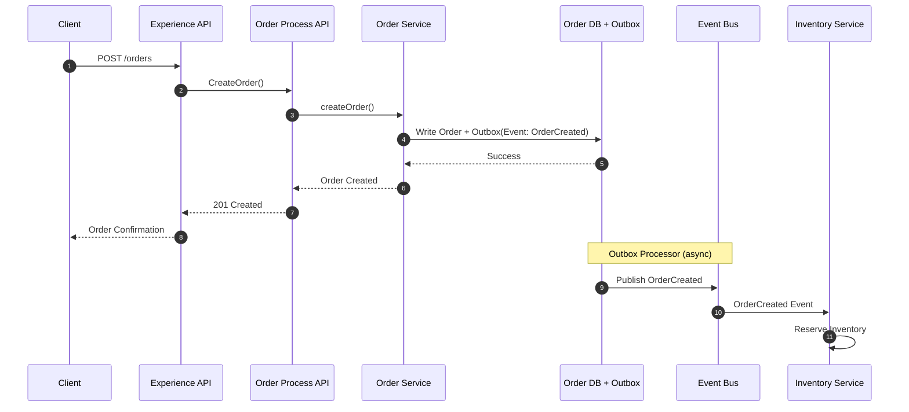
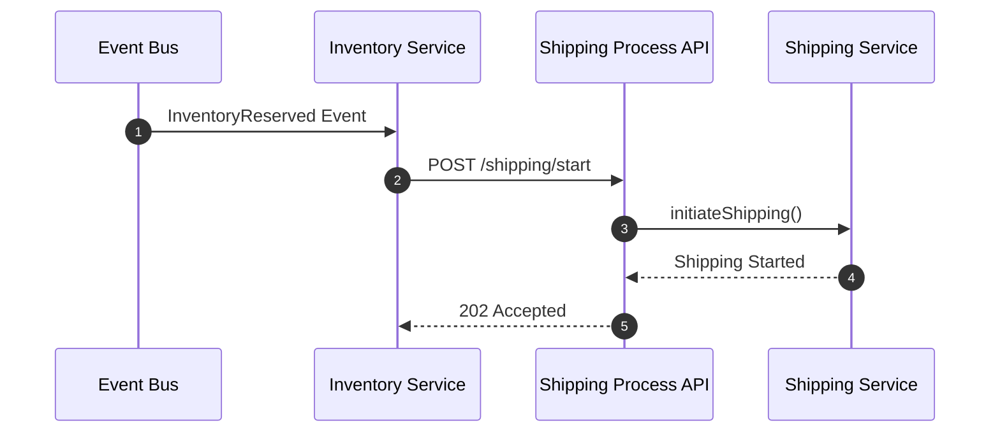
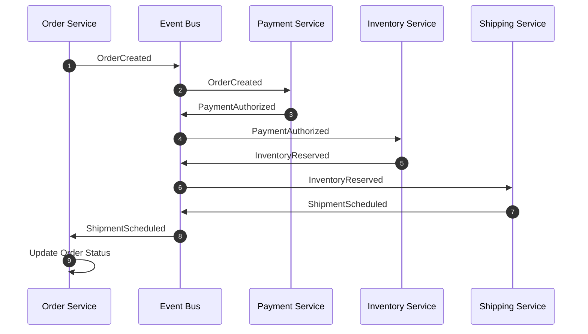
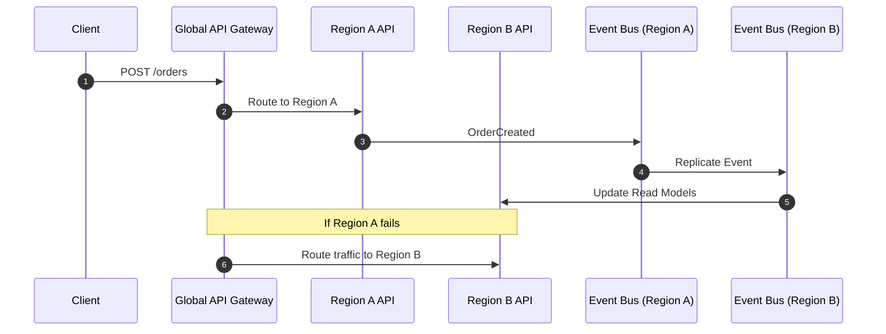

# 🔄 Integration Sequence Diagrams  
*API + Event Workflows Across Domains*

This document provides sequence diagrams illustrating how APIs and events collaborate across domains to support key business workflows.

---

# 1. Order Creation (API Command → Event Publish)

A synchronous API call triggers a domain event using the Outbox Pattern.

# 2. Inventory Reservation (Event → API Call)
A domain event triggers downstream API orchestration.

# 3. Payment Workflow (Fully Event‑Driven)
A chain of events drives the entire workflow without synchronous orchestration.

# 4.  Multi‑Region Failover (API + Events)
Illustrates how a global API gateway and replicated event backbone work together.

