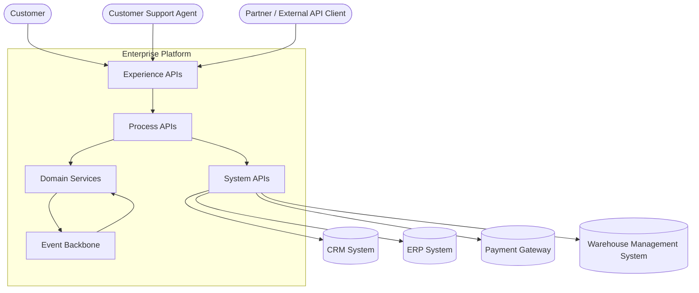
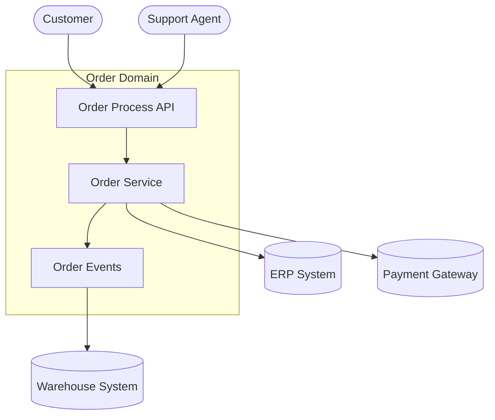
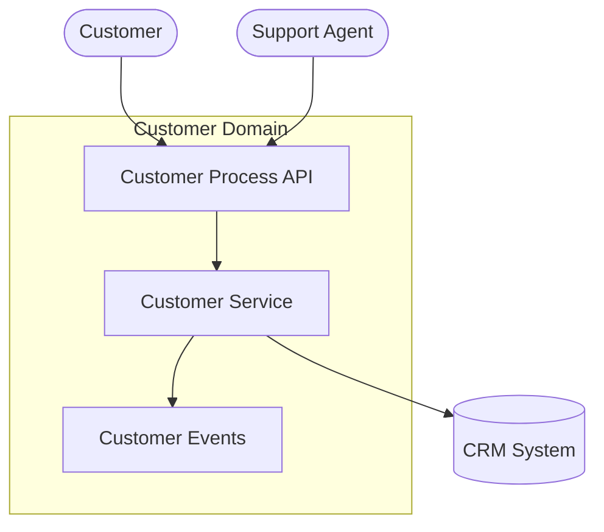
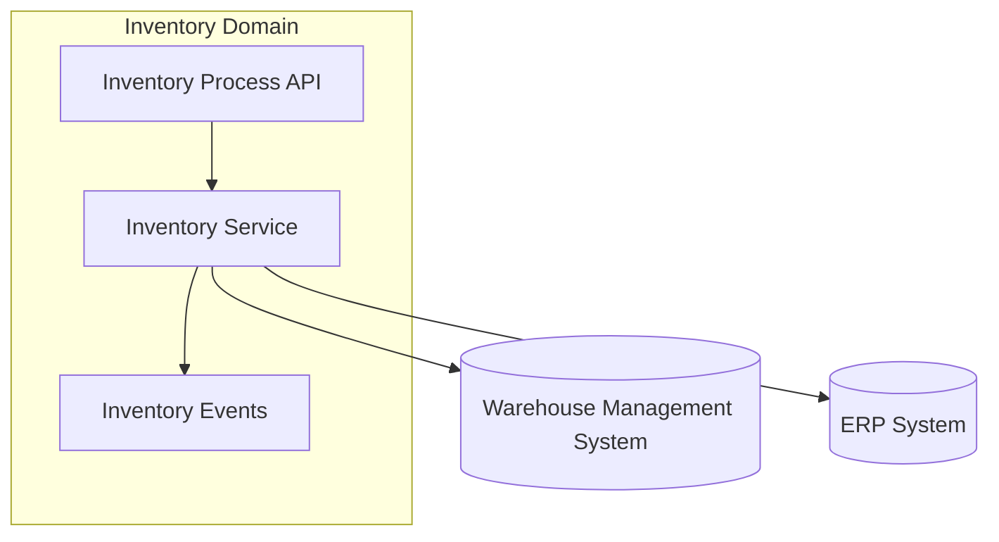
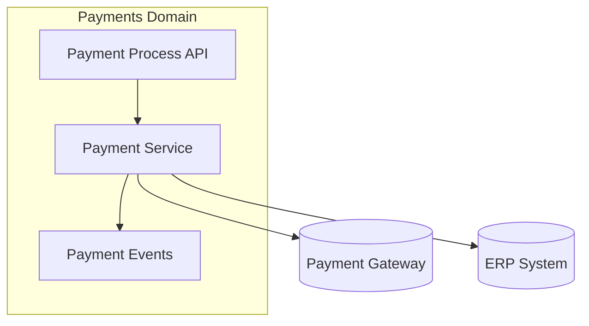

# 🧭 C4 Model — System Context Diagrams  
*Level 1 of the C4 Model for the Enterprise Platform*

This document provides System Context diagrams showing how users, external systems, and internal domains interact with the platform.

---

# 1. Enterprise Platform — System Context (C4 Level 1)

# 2. Order Domain — System Context

# 3.  Customer Domain — System Context

# 4. Inventory Domain — System Context

# 5. Payments Domain — System Context

# 6. Related Artifacts
/architecture/integration-architecture.md

/architecture/diagrams/integration-sequence-diagrams.md

/events/event-naming-and-domain-modeling-guide.md

/governance/api-standards-and-governance-guide.md

/strategy/north-star-architecture.md
