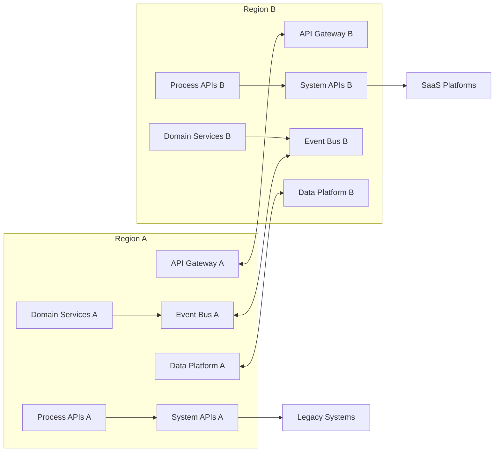

# 🏗️ Reference Architecture — API‑Led, Event‑Driven, Multi‑Region

A scalable, resilient, globally distributed architecture that combines API‑led integration with an event‑driven backbone to support mission‑critical enterprise workloads.

---

# 🌍 1. Architecture Overview

This reference architecture enables:

- Global availability across multiple regions  
- Loose coupling through APIs and events  
- Real‑time data propagation  
- Zero‑downtime failover  
- Domain‑aligned microservices  
- Consistent integration patterns  
- Scalable, secure, governed interfaces  

It is designed for enterprises operating across geographies, business units, and legacy systems.

---

# 🧱 2. High‑Level Architecture Diagram

# 🧭 3. API‑Led Architecture Layers
1. Experience APIs
Purpose‑built for channels:

Mobile

Web

Partner integrations

Internal portals

Characteristics:

Tailored payloads

No business logic

Versioned and governed