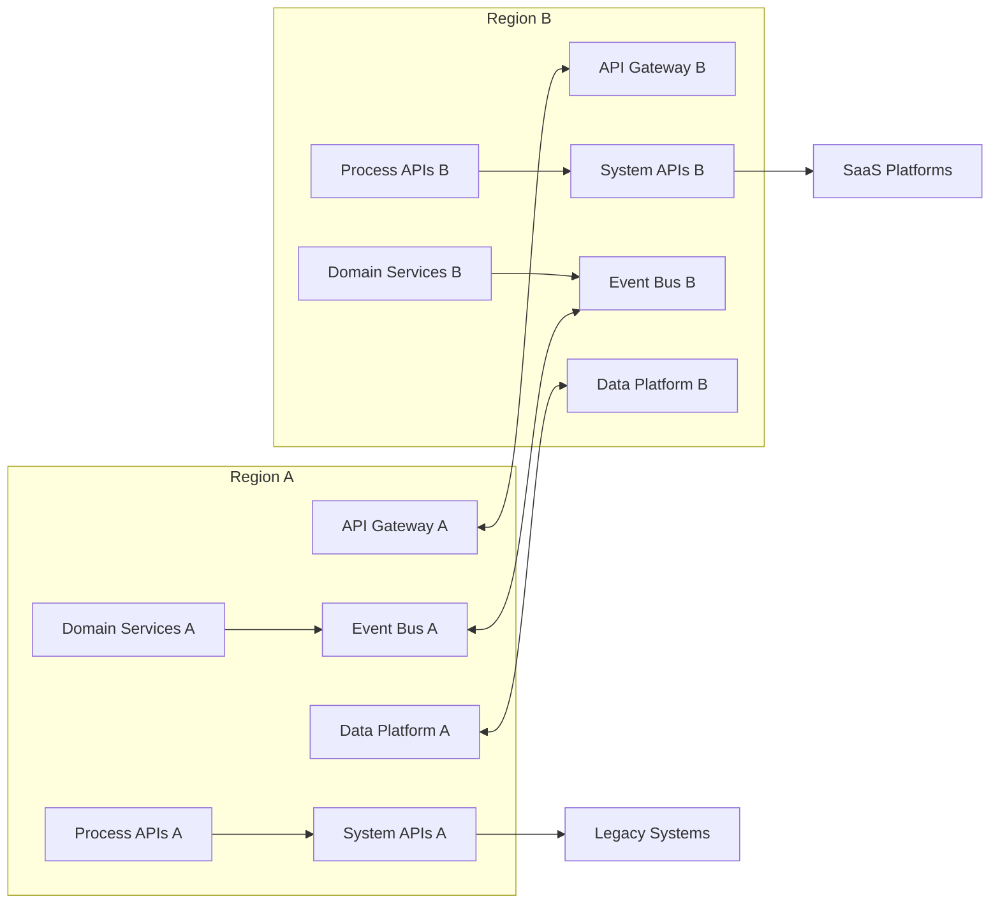

# 🏗️ Reference Architecture — API‑Led, Event‑Driven, Multi‑Region

A scalable, resilient, globally distributed architecture that combines API‑led integration with an event‑driven backbone to support mission‑critical enterprise workloads.

---

# 🌍 1. Architecture Overview

This reference architecture enables:

- Global availability across multiple regions  
- Loose coupling through APIs and events  
- Real‑time data propagation  
- Zero‑downtime failover  
- Domain‑aligned microservices  
- Consistent integration patterns  
- Scalable, secure, governed interfaces  

It is designed for enterprises operating across geographies, business units, and legacy systems.

---

# 🧱 2. High‑Level Architecture Diagram

---

# 🧭 3. API‑Led Architecture Layers

## 1. Experience APIs
Purpose‑built for channels:
- Mobile  
- Web  
- Partner integrations  
- Internal portals  

Characteristics:
- Tailored payloads  
- No business logic  
- Versioned and governed  

## 2. Process APIs
Orchestrate business workflows:
- Order lifecycle  
- Customer onboarding  
- Inventory allocation  

Characteristics:
- Stateless  
- Reusable across channels  
- Encapsulate business logic  

## 3. System APIs
Stable interfaces to systems of record:
- ERP  
- CRM  
- Payments  
- Warehouse systems  
- SaaS platforms  

Characteristics:
- Abstract legacy complexity  
- Provide canonical models  
- Reduce point‑to‑point sprawl  

---

# ⚡ 4. Event‑Driven Backbone

The event backbone enables:
- Real‑time communication  
- Loose coupling  
- Multi‑region replication  
- Replayable event streams  
- Choreographed workflows  

### Event Types
- Domain events (OrderCreated, InventoryReserved)  
- Integration events (CustomerUpdated)  
- Platform events (DeploymentCompleted)  

### Event Platform Capabilities
- Cross‑region replication  
- Schema registry  
- Dead‑letter queues  
- Consumer groups  
- At‑least‑once delivery  

---

# 🌐 5. Multi‑Region Strategy

## Active‑Active
Both regions serve traffic simultaneously.

Benefits:
- Zero‑downtime failover  
- Low latency for global users  
- Continuous availability  

## Data Replication
- Event streams replicated across regions  
- Data lakehouse uses cross‑region sync  
- Caches use global distribution  

## API Gateway Global Routing
- Geo‑DNS or global load balancer  
- Health‑based routing  
- Canary and blue/green support  

## Failover Patterns
- Automatic failover for APIs  
- Event replay for state recovery  
- Data platform checkpointing  

---

# 🧩 6. Domain Services

Domain services are:
- Independently deployable  
- Aligned to business capabilities  
- Stateless where possible  
- Observable (metrics, logs, traces)  
- Versioned and backward compatible  

Examples:
- Order Service  
- Customer Service  
- Inventory Service  
- Pricing Service  

---

# 🔐 7. Security Architecture

Security is applied consistently across regions:

## Identity & Access
- OAuth2 / OIDC  
- Fine‑grained scopes  
- Service‑to‑service mTLS  

## API Security
- Rate limiting  
- Threat protection  
- WAF integration  

## Event Security
- Topic‑level ACLs  
- Producer/consumer identity  
- Encryption in transit and at rest  

## Data Security
- Column‑level encryption  
- Tokenization for PII  
- Zero‑trust access model  

---

# 🛠️ 8. Platform Capabilities

The platform provides shared services:

- API Gateway  
- Event Bus  
- CI/CD pipelines  
- Secrets management  
- Observability stack  
- Feature flags  
- Service mesh  
- Data platform (lakehouse + streaming)  

These reduce duplication and accelerate delivery.

---

# 📈 9. Non‑Functional Requirements (NFRs)

## Availability
- 99.99% target  
- Multi‑region redundancy  

## Scalability
- Horizontal scaling for APIs and services  
- Partitioned event streams  

## Performance
- < 200ms API latency  
- Sub‑second event propagation  

## Resilience
- Circuit breakers  
- Retries with backoff  
- Bulkheads  
- Chaos testing  

## Compliance
- Audit logging  
- Data residency controls  
- Policy‑as‑code  

---

# 🧪 10. Validation & Testing

## Resiliency Testing
- Region failover drills  
- Event replay validation  
- Latency degradation tests  

## Performance Testing
- Load tests per region  
- Cross‑region throughput tests  

## Security Testing
- Pen tests  
- API fuzzing  
- Event schema validation  

---

# 📄 11. Related Artifacts

- `/strategy/north-star-architecture.md`  
- `/governance/architecture-operating-model.md`  
- `/architecture/diagrams/`  
- `/architecture/integration-architecture.md`  
- `/governance/adr-template.md`  
