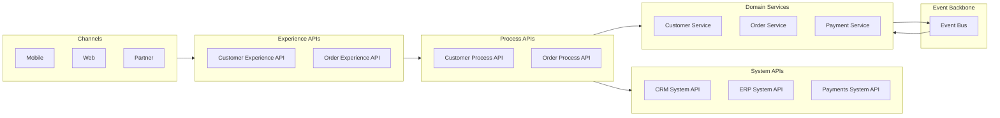

# 🔗 Integration Architecture (API + Events)

A unified integration architecture that combines API‑led connectivity with an event‑driven backbone to enable scalable, resilient, real‑time enterprise integration.

---

# 🧭 1. Purpose

This architecture defines how systems, domains, and services integrate using:
- API‑led patterns (Experience, Process, System APIs)
- Event‑driven patterns (domain events, integration events)
- Multi‑region replication and resiliency
- Canonical data models and governance

It ensures consistency, loose coupling, and long‑term maintainability across the enterprise.

---

# 🧱 2. Integration Principles

### **1. API‑First**
All synchronous interactions use well‑designed, versioned APIs.

### **2. Event‑First for Asynchronous Workflows**
Business facts are published as events to decouple producers and consumers.

### **3. Canonical Models**
Shared data fields follow enterprise canonical definitions.

### **4. Loose Coupling**
Systems communicate through stable APIs and events, not direct DB access.

### **5. Resilience by Design**
Retries, idempotency, and event replay ensure reliable integration.

---

# 🏗️ 3. High‑Level Integration Architecture

🧩 4. API‑Led Integration Patterns
Experience APIs
Channel‑specific

Tailored payloads

No business logic

Versioned and backward compatible

Process APIs
Orchestrate workflows

Encapsulate business logic

Reusable across channels

Stateless

System APIs
Stable interfaces to systems of record

Canonical models

Abstract legacy complexity

⚡ 5. Event‑Driven Integration Patterns
Domain Events
Represent business facts:

OrderCreated

CustomerUpdated

PaymentAuthorized

Integration Events
Used for cross‑system synchronization:

CustomerSyncedToCRM

InventoryAdjusted

Event Choreography
Services react to events without central orchestration.

Event Replay
Used for:

Rebuilding state

Multi‑region recovery

New consumer onboarding

🔄 6. Hybrid Integration Patterns (API + Events)
1. API Command → Event Publish
A synchronous API call triggers an event.

Example:

Code
POST /orders
→ OrderCreated event emitted
2. Event → API Call
A service reacts to an event and calls an API.

Example:

Code
InventoryReserved event
→ call Shipping Process API
3. API + Event Dual Write (Outbox Pattern)
Ensures consistency between DB and event bus.

4. Event‑Driven Orchestration
Process APIs orchestrate, events choreograph.

🌐 7. Multi‑Region Integration Considerations
API Layer
Global load balancing

Active‑active routing

Region‑local failover

Event Layer
Cross‑region replication

Consumer offset synchronization

DLQ per region

Data Layer
Lakehouse replication

Transactional DB replication

Cache warming

🔐 8. Security & Governance
API Security
OAuth2 / OIDC

mTLS

Rate limiting

Threat protection

Event Security
Topic‑level ACLs

Producer/consumer identity

Encryption in transit and at rest

Governance
API standards

Event schema standards

Versioning rules

Registry requirements

🧪 9. Validation & Testing
API Testing
Unit tests

Contract tests

Integration tests

Performance tests

Event Testing
Schema validation

Backward compatibility

Consumer lag tests

Replay tests

End‑to‑End Testing
Cross‑domain workflows

Multi‑region failover scenarios

📄 10. Related Artifacts
/governance/api-standards-and-governance-guide.md

/governance/event-schema-standards.md

/architecture/reference-architectures/api-led-event-driven-multi-region.md

/architecture/reference-architectures/multi-region-failover-playbook.md

/architecture/integration-architecture.md