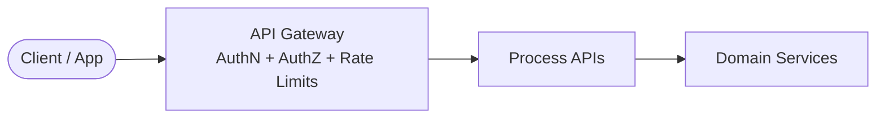
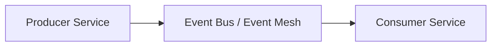

# 🔐 Security Architecture Overview  
*A unified security model for APIs, events, data, and multi‑region operations.*

---

# 🧭 1. Purpose

This document defines the enterprise security architecture that protects APIs, events, data, and services across all regions. It ensures:

- Strong identity and access control  
- Consistent API and event security  
- Zero‑trust enforcement  
- Encryption and secrets management  
- Threat detection and monitoring  
- Multi‑region resilience  

This architecture applies across all domains and platform components.

---

# 🧱 2. Security Principles

### **1. Zero‑Trust by Default**
Every request is authenticated, authorized, and validated — no implicit trust.

### **2. Least Privilege**
Services and users receive only the minimum access required.

### **3. Defense in Depth**
Multiple layers of protection across APIs, events, data, and infrastructure.

### **4. Secure by Design**
Security is embedded into architecture, not added later.

### **5. Continuous Monitoring**
Threat detection, anomaly detection, and automated alerting.

---

# 🧩 3. Identity & Access Architecture

## **3.1 Identity Providers**
- OAuth2 / OIDC provider  
- SSO for internal users  
- API clients authenticated via client credentials  

## **3.2 Access Control**
- RBAC for users  
- ABAC for services  
- Fine‑grained permissions for APIs and events  

## **3.3 Token Standards**
- JWT access tokens  
- Short‑lived tokens with refresh  
- mTLS for service‑to‑service communication  

---

# 🔗 4. API Security Architecture

API Gateway Responsibilities
-Authentication (OAuth2 / OIDC)

-Authorization (RBAC / ABAC)

-Rate limiting & throttling

-Threat protection (WAF)

-Schema validation

-Logging & tracing injection

API Security Controls
-mTLS between internal services

-Input validation

-Output sanitization

-Versioned APIs

-Audit logging

# ⚡ 5. Event Security Architecture

Event Security Controls
-Topic‑level ACLs

Producer identity verification

Consumer identity verification

Encryption in transit (TLS)

Encryption at rest

Schema validation

Replay protection

Dead‑letter queue isolation

Event Governance
Schema registry

Versioning rules

Backward compatibility checks

Event review checklist

#  🗄️ 6. Data Security Architecture
Operational Data Stores
Row‑level and column‑level access controls

Encryption at rest

mTLS for DB connections

Secrets stored in vault

Lakehouse / Analytics
Object‑level access policies

Tokenized sensitive fields

Data masking for PII

Metadata catalog with lineage

Data in Motion
TLS 1.2+

Event encryption

Secure ETL pipelines

#  🌐 7. Multi‑Region Security
Identity
Global identity provider

Region‑local token validation

Failover‑ready authentication

API Layer
Global API gateway

Region‑local WAF

Geo‑routing with health checks

Event Layer
Secure cross‑region replication

Region‑isolated DLQs

Replay with integrity validation

Data Layer
Encrypted replication

Region‑local key management

Disaster recovery with secure restore

#  🛡️ 8. Threat Detection & Monitoring
Detection
Anomaly detection

Suspicious API usage

Event consumption anomalies

Data exfiltration patterns

Monitoring
Metrics

Logs

Traces

SIEM integration

Response
Automated alerts

Incident response runbooks

Forensics and audit trails

#  🧪 9. Security Testing
Static application security testing (SAST)

Dynamic application security testing (DAST)

Penetration testing

API contract security tests

Event schema validation tests

Secrets scanning

#  📄 10. Related Artifacts
/architecture/integration-architecture.md

/architecture/data-architecture-overview.md

/architecture/diagrams/container-diagrams.md

/governance/api-standards-and-governance-guide.md

/governance/event-schema-standards.md

/strategy/north-star-architecture.md