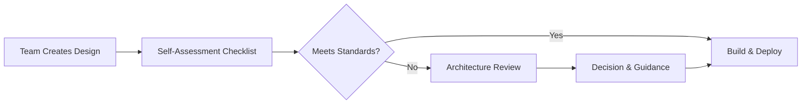

# 🏛️ Architecture Operating Model

A practical, scalable operating model that defines how architecture engages with teams, how decisions are made, and how governance is applied without slowing delivery.

---

## 📘 1. Introduction

The Architecture Operating Model ensures that architectural decisions are:

- **Aligned** with business strategy  
- **Consistent** across domains  
- **Scalable** as the enterprise grows  
- **Empowering** for product and engineering teams  
- **Measured** through clear KPIs  

This model balances governance with team autonomy, enabling fast, high‑quality delivery across the enterprise.

---

## 🧭 2. Engagement Model

Architecture engages with teams through three modes:

### **Strategic Engagement (Quarterly)**
- Define and refine the North Star Architecture  
- Update capability models  
- Align with business strategy  
- Prioritize platform investments  

### **Program Engagement (Monthly)**
- Support major initiatives  
- Provide reference architectures  
- Validate integration patterns  
- Ensure cross‑domain alignment  

### **Team Engagement (On Demand)**
- Lightweight design reviews  
- API and event schema guidance  
- Cloud architecture support  
- Performance and resiliency patterns  

This model ensures architecture is proactive, not reactive.

---

## 🏗️ 3. Governance Workflow

### Workflow Principles

**Self‑service first:** Teams use checklists, templates, and standards.  
**Review only when needed:** Triggered by risk, not bureaucracy.  
**Fast turnaround:** Reviews completed within 48 hours.

---

## 🔑 4. Key Concepts

### Self‑Service First
Teams rely on:
- Checklists  
- Templates  
- Standards  
- Reference architectures  

This reduces friction and prevents architecture from becoming a bottleneck.

### Review Only When Needed
Architecture reviews are triggered by:
- High‑risk changes  
- Cross‑domain impacts  
- New technologies  
- Major integration patterns  

### Fast Turnaround
Architecture commits to:
- 48‑hour SLA  
- Clear, actionable feedback  
- Lightweight documentation  

---

## 🧩 5. Decision Rights (RACI)

| Decision Type        | Product Team | Architecture | Platform Eng | Security |
|----------------------|--------------|--------------|--------------|----------|
| API design           | R            | A            | C            | C        |
| Event schema         | R            | A            | C            | C        |
| Domain boundaries    | C            | A            | C            | C        |
| Technology selection | R            | A            | C            | C        |
| Cloud architecture   | R            | C            | A            | C        |
| Data contracts       | R            | A            | C            | C        |
| Resiliency patterns  | R            | A            | C            | C        |
| Security controls    | C            | C            | C            | A        |

**R = Responsible, A = Accountable, C = Consulted**

Architecture is accountable for standards, patterns, and long‑term direction.  
Teams remain responsible for delivery and implementation.

---

## 🏛️ 6. Architecture Review Process

A lightweight, predictable process that ensures alignment without slowing teams.

### Step 1 — Team Submits Design
Teams provide:
- High‑level architecture diagram  
- API specs or event schemas  
- Key decisions + trade‑offs  
- Risks or open questions  

### Step 2 — Architecture Performs Review
Architecture evaluates:
- Alignment with principles  
- Cross‑domain impacts  
- Security and resiliency risks  
- Opportunities for reuse  

### Step 3 — Decision
Architecture returns one of three outcomes:
- Approved  
- Approved with recommendations  
- Requires revision  

### Step 4 — Documentation
For major decisions:
- An ADR is created  
- Linked to the service or initiative  
- Stored in the appropriate repo  

---

## 🧱 7. Architecture Artifacts

Architecture produces and maintains three categories of artifacts:

### 1. Strategic
- North Star Architecture  
- Capability model  
- Multi‑year roadmap  

### 2. Governance
- Architecture principles  
- ADR templates  
- API and event standards  
- Security and resiliency patterns  

### 3. Technical
- Reference architectures  
- C4 diagrams  
- Integration patterns  
- Cloud architecture blueprints  

---

## 🔄 8. Operating Cadence

| Cadence     | Activity                                      |
|-------------|-----------------------------------------------|
| Weekly      | Architecture sync with platform & engineering |
| Bi‑Weekly   | Design reviews                                |
| Monthly     | Program alignment + roadmap updates           |
| Quarterly   | Strategic planning + capability model updates |
| Annually    | Architecture maturity assessment              |

---

## 📈 9. KPIs & Success Measures

### Delivery
- Reduction in cycle time  
- Faster integration onboarding  
- % of reusable components adopted  

### Quality
- Reduction in production incidents  
- Reduction in integration defects  
- Resiliency test pass rate  

### Architecture Health
- % of services aligned to standards  
- % of APIs with versioning & governance  
- % of events with schema registry compliance  

### Business Impact
- Cost savings from platform reuse  
- Faster M&A integration  
- Improved customer experience metrics  

---

## 📄 10. Related Artifacts

- `/strategy/north-star-architecture.md`  
- `/architecture/diagrams/`  
- `/governance/adr-template.md`  
- `/governance/raci.md`  
- `/governance/architecture-review-process.md`  
